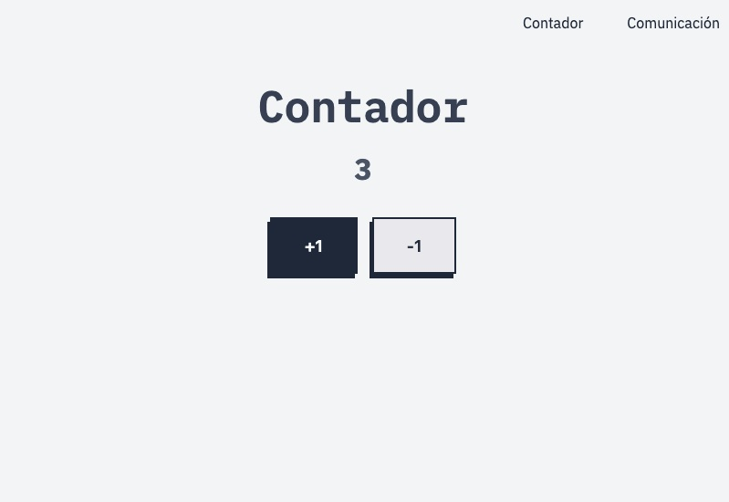
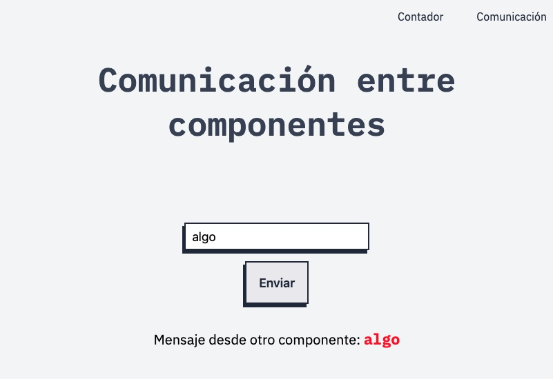
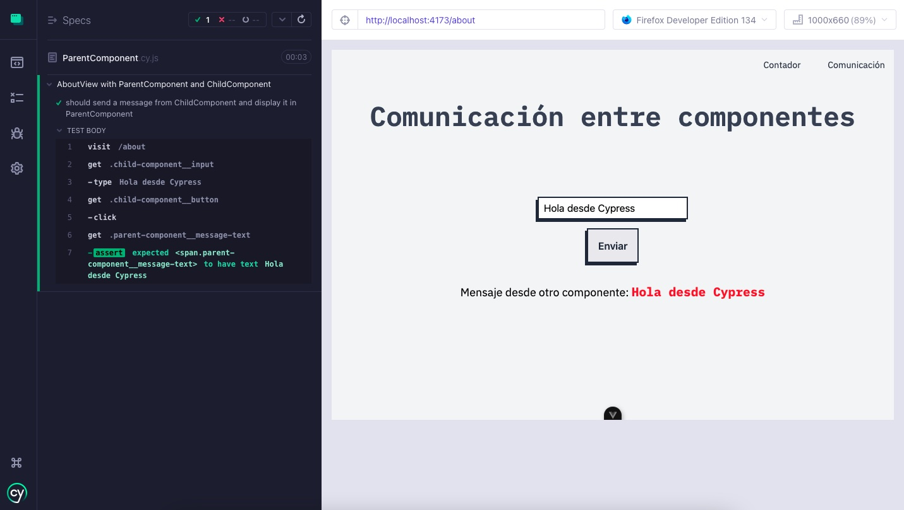

# Desarrollo de Aplicaciones Front-End con Vue

Este repositorio contiene el desarrollo de una prueba técnica orientada a validar conocimientos en la construcción de aplicaciones front-end utilizando Vue.js. El proyecto incluye la implementación de funcionalidades clave del framework, integración de herramientas adicionales y pruebas automatizadas para garantizar la calidad del código.

## Tecnologías Utilizadas

- **Vue.js**: Framework principal para la creación de componentes.
- **Vue Router**: Manejo de la navegación entre vistas.
- **Vuex**: Gestión centralizada del estado.
- **Sass**: Preprocesador CSS para estilos más organizados y reutilizables.
- **Vitest**: Pruebas unitarias, como alternativa a Jest.
- **Cypress**: Pruebas end-to-end.
- **Firebase Hosting**: Despliegue del proyecto en un entorno de producción.

## Descripción de los Ejercicios

1. **Manejo del Estado con Vuex**  
   Configuración de Vuex para implementar un contador que permita incrementar y decrementar su valor. Incluye pruebas unitarias para:
   - Validar el valor inicial del contador.
   - Verificar la funcionalidad de incremento y decremento.

2. **Navegación con Vue Router**  
   Validación de la existencia de componentes asociados a las vistas generadas por Vue Router mediante pruebas unitarias.

3. **Comunicación entre Componentes**  
   Implementación de dos componentes (`ParentComponent.vue` y `ChildComponent.vue`) que se comunican mediante eventos:
   - El componente `ChildComponent` envía texto al `ParentComponent` al presionar un botón.
   - Se incluye una prueba para garantizar que el texto es enviado correctamente.

4. **Despliegue en Firebase Hosting**  
   Generación del build de producción y despliegue en Firebase Hosting.

## Capturas de pantalla del proyecto

## Captura de la prueba end-to-end

### Instalación de Sass
- **npm install -D sass-embedded** 

### Ejecución de los test end-to-end:
- **npm run test:e2e:dev** 